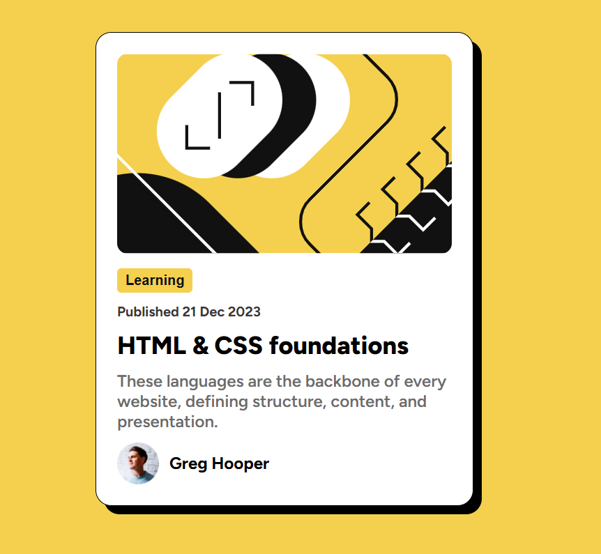

# Blog Preview Card Solution

A responsive Blog Preview Card solution for the Frontend Mentor Challenge built using HTML and CSS only.

# Overview

This project is a solution to the Frontend Mentor Blog Preview Card challenge. The objective was to recreate the provided design as accurately as possible while implementing responsive behavior and interactive hover effects.

The project focuses on improving frontend fundamentals such as:

Semantic HTML structure
CSS styling and positioning
Responsive design techniques
Hover interactions
Flexbox alignment
Card UI design

# Features
Fully responsive layout
Clean blog card UI
Interactive hover effects
Mobile-friendly design
Semantic HTML5 markup
Pure CSS styling
Custom box-shadow styling

# Built With
HTML5
CSS3
Flexbox

# Project Preview

🔗 Live Demo
Live Site URL: 
Repository URL:

# What I Learned

While building this project, I improved my understanding of responsive card layouts, hover interactions, and custom shadow styling using only HTML and CSS.

I also learned how to create clean modern card components with proper spacing and typography.

# Author
Website -[Akinyemi Imoleayo]() 
Frontend Mentor - [@Imoleayo-0](https://www.frontendmentor.io/profile/Imoleayo-0)

# Acknowledgements

Thanks to Frontend Mentor for providing practical frontend challenges that help developers improve their skills through hands-on projects.